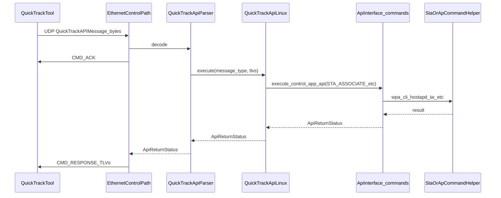

# Wi-Fi QuickTrack Linux Python 控制应用教程

面向参与 Wi-Fi Alliance **QuickTrack** 认证测试的工程师：说明本仓库在测试体系中的位置、如何运行与排错，以及如何按 WFA 协议扩展与移植。

**对应源码版本**：仓库内 `ReleaseNote` 记载为 Python ControlApp release 2.2（Release #2.2.0.1），覆盖 APUT、STAUT、P2P、AFC DUT。

---

## 第 1 章：QuickTrack 与 DUT Control App 的关系

### 1.1 在认证流程中的角色

QuickTrack 测试工具运行在测试 PC（或同等环境）上，通过**控制面**向被测设备（DUT）下发动作与查询。本仓库实现的是运行在 **DUT 上的 Control Application（控制应用）**：在 Linux 上监听指定 **IP 与 UDP 端口**，接收工具发来的 **二进制 QuickTrack API 消息**，解析为具体命令后，再调用本机上的 **wpa_supplicant、hostapd、iw、网络配置** 等（具体命令封装在 `StaCommandHelper`、`ApCommandHelper`、`CommandHelper` 中）。

从 WFA 认证视角看，**消息格式、命令字（message type）与 TLV 语义**需要与 QuickTrack 工具保持一致，这样同一套测试用例才能在不同 DUT 上复现。本仓库提供的是 **Linux 上的参考实现**；厂商常见做法是 **保留消息解析与 `QuickTrackApiParser` 分发逻辑**，**替换或继承 Helper**，以对接自有驱动、私有 CLI 或不同的网络栈行为。

### 1.2 客户端与服务端

- **测试工具**：作为 UDP 客户端，向 DUT 的 IP/端口发送请求报文。
- **本应用**：作为 UDP 服务端，`bind` 后循环 `recvfrom`，处理每条请求并回复。

### 1.3 功能范围

与 [`ReleaseNote`](../ReleaseNote) 一致，本发布包含：

- **APUT**：软 AP / 热点侧行为（`AP_*` API）。
- **STAUT**：站点关联、配置、WPS、ANQP、BTM 等（`STA_*` 及部分通用 API）。
- **P2P**：Wi-Fi Direct 相关（`P2P_*` API）。
- **AFC DUT**：6 GHz AFC 设备侧（`AFCD_*` API）。

---

## 第 2 章：仓库布局与模块职责

### 2.1 入口

- [`app.py`](../app.py)：解析 CLI（接口名、IP、端口），构造 `ConnectionInfo`，创建 `QuickTrackApiParser`（绑定 `QuickTrackApiLinux` 实现）、`EthernetControlPath`，最后调用 `start()` 进入接收循环。

### 2.2 目录速查

| 路径 | 职责 |
|------|------|
| [`interfaces/`](../interfaces/) | 控制路径抽象 [`control_path.py`](../interfaces/control_path.py)；以太网实现 [`ethernet_control_path.py`](../interfaces/ethernet_control_path.py)（UDP 收发包）。 |
| [`quicktrack_api_message/`](../quicktrack_api_message/) | [`quicktrack_api_message.py`](../quicktrack_api_message/quicktrack_api_message.py)：`QuickTrackMessageType` 命令字枚举、`QuickTrackAPIMessage` 编解码（版本、message_id、TLV 序列）。 |
| [`parsers/`](../parsers/) | [`quicktrack_api_parser.py`](../parsers/quicktrack_api_parser.py)：将解码后的 `message_type` 分发给 `QuickTrackApiLinux` 的对应方法。 |
| [`api/`](../api/) | [`quicktrack_api_linux.py`](../api/quicktrack_api_linux.py)：每个 API 一行式转发到 `Commands` 包中的 `ApiInterface` 子类；[`control_app_helper.py`](../api/control_app_helper.py)：CLI、`execute_control_app_api`、多频段接口解析。 |
| [`Commands/`](../Commands/) | 具体 API 类（如 `STA_ASSOCIATE`）、`*CommandHelper`、`shared_enums`（含 `QuickTrackRequestTLV` / `QuickTrackResponseTLV`）、[`commands.json`](../Commands/commands.json) + [`command_interpreter.py`](../Commands/command_interpreter.py)（shell 与正则解析）。 |
| [`loopBackClient/`](../loopBackClient/) | UDP 环回服务线程，配合 `START_LOOP_BACK_SERVER` / `STOP_LOOP_BACK_SERVER`。 |

### 2.3 可选的 Helper 替换钩子

- [`app.py`](../app.py) 与 [`control_app_helper.py`](../api/control_app_helper.py) 中尝试 `from Commands.XXX_command_helper import XXX_CommandHelper as CommandHelper`，失败则回退到默认 [`command_helper.py`](../Commands/command_helper.py)。
- [`sta_commands.py`](../Commands/sta_commands.py)、[`ap_commands.py`](../Commands/ap_commands.py) 同样支持 `XXX_sta_command_helper` / `XXX_ap_command_helper` 替换。

---

## 第 3 章：安装、权限与启动

### 3.1 权限与运行用户

入口调用 `CommandHelper.check_if_root_user()`（见 [`app.py`](../app.py)）。配置无线接口、网桥、DHCP、静态 IP 等通常需要 **root**，请使用 `sudo` 运行。

### 3.2 日志文件位置

[`DutLogger`](../Commands/dut_logger.py) 在设置 `log_file_name` 后，会向 **`/var/log/<文件名>`** 追加日志。若无法写入，需检查目录权限或使用有权限的环境。

### 3.3 命令行参数

[`ControlAppHelper.get_optional_parameters()`](../api/control_app_helper.py) 使用 `getopt` 解析：

- `--interface`：无线接口逻辑名或 APUT 多频段映射字符串。
- `--ip`：控制套接字绑定的 IPv4；未指定或非法时为 **`0.0.0.0`**（`INADDR_ANY`）。
- `--port`：UDP 端口；未指定时为 **`9004`**（`DEFAULT_PORT`）。

### 3.4 启动示例（与 README 一致）

**STAUT（站点 DUT）**：

```bash
sudo python3 ./app.py
sudo python3 ./app.py --interface wlan0
```

未指定 `--interface` 时，会枚举无线接口并可能 **交互式** 让用户选择（见 `get_default_wlan_name`）。

**APUT（AP DUT，多射频）**：

`--interface` 使用 **`频段前缀:接口名`**，多个条目用逗号分隔：

- 仅 2.4 GHz：`2:<2.4G 接口名>`
- 2.4 GHz + 5 GHz：`2:<if24>,5:<if5>`
- 含 6 GHz：`6:<if6>`（与 `2:`、`5:` 组合方式相同）

[`ControlAppHelper.set_wireless_if`](../api/control_app_helper.py) 会解析并写入 `CommandHelper.INTERFACE_LIST`，并在需要时创建/检查 WLAN 接口。

### 3.5 Python 路径

应用从仓库根目录运行，依赖同级包导入（`Commands`、`api`、`interfaces` 等）。若使用虚拟环境，在仓库根目录激活后执行 `python3 ./app.py` 即可。

### 3.6 本地验证控制面（模拟 QuickTrack 工具）

仓库提供 UDP 客户端脚本 [`tools/quicktrack_sim_client.py`](../tools/quicktrack_sim_client.py)，可在**与 DUT 网络互通的任意机器**上（或本机）向控制应用发送与 QuickTrack 工具相同格式的二进制报文，并读取 **`CMD_ACK` + `CMD_RESPONSE`**，用于快速检查端口、协议与部分 API 是否可用。

在**仓库根目录**执行示例：

```bash
# 默认与安全探测等价：仅 GET_CONTROL_APP_VERSION、GET_IP_ADDR、GET_MAC_ADDR（空 TLV）
python3 tools/quicktrack_sim_client.py --host <DUT_IP> --port 9004

python3 tools/quicktrack_sim_client.py --host <DUT_IP> --safe-probe

# 单条命令（枚举名同 QuickTrackMessageType）
python3 tools/quicktrack_sim_client.py --host <DUT_IP> --command GET_CONTROL_APP_VERSION
```

`--all-commands` 会依次发送除 `CMD_ACK`/`CMD_RESPONSE` 外的全部命令字，**可能关联/断线/启停 AP/复位等**，仅允许在隔离实验台使用，且必须同时传入 `--i-understand-risk`。

脚本退出码：安全探测或单次命令路径下，若各条响应 TLV 中 **STATUS 均为 `0`** 则返回 0，否则返回 1。

---

## 第 4 章：外部命令与路径约定（`iw`、`wpa_supplicant`、`wpa_cli` 等）

本章说明：控制应用**并不**要求你在某个固定「工作目录」下手动执行这些工具；它们由 [`CommandHelper.run_shell_command`](../Commands/command_helper.py)（`subprocess` + `shell=True`）在 **启动 `app.py` 时的当前工作目录（CWD）** 下调用。多数命令依赖 **`PATH` 环境变量** 或 **写死的绝对路径**，与仓库目录无关。

### 4.1 与工作目录（CWD）的关系

- 从**任意目录**执行 `sudo python3 /path/to/repo/app.py` 时，子 shell 的 CWD 就是该目录；源码里的外部命令字符串**几乎不**使用相对路径依赖 CWD。
- **建议**：仍从仓库根目录启动（与第 3 章一致），便于日志与相对路径的 Python 导入；但不要指望「必须在 `/usr/local/bin` 下运行 app」之类约定。
- **例外**：若你在 Helper 里自行添加了依赖 CWD 的脚本路径，则需统一启动方式或在代码里改为绝对路径。

### 4.2 必须在 `PATH` 中的命令（`commands.json` 与 Helper）

[`commands.json`](../Commands/commands.json) 与部分 Helper 通过**命令名**调用（由 root 用户的默认 `PATH` 解析），典型包括：

| 工具 | 出现场景（示例） |
|------|------------------|
| `iw` | 接口信息、MAC、AP 侧 SSID 查询；[`command_helper.py`](../Commands/command_helper.py) 中 `iw dev`、创建虚拟接口等 |
| `wpa_cli` | STA 参数、BTM/ANQP、`status`/`scan`/`disconnect` 等（[`sta_command_helper.py`](../Commands/sta_command_helper.py)、`commands.json` 的 `set-sta-param` 等） |
| `hostapd_cli` | AP 参数、信道切换、BTM、`all_sta`、WPS 等（[`ap_command_helper.py`](../Commands/ap_command_helper.py)、`commands.json`） |
| `ip` | IPv4 地址（`get-interface-ip-address`） |
| `lshw` | 按前缀扫描逻辑接口名 |
| `timeout` | 多条命令外层超时 |
| `rfkill`、`killall`、`pidof`、`mkdir`、`mv`、`rm` 等 | Helper 中进程与文件维护 |

**注意**：`sudo` 后的环境可能缩小 `PATH`。若出现「找不到 `wpa_cli`/`iw`」类错误，应在系统层保证 **`/usr/sbin`、`/sbin`** 等在 root/sudo 的 `PATH` 中，或使用绝对路径（厂商定制 Helper 时常改此处）。

### 4.3 WFA 指定路径的 `hostapd` / `wpa_supplicant`（重要）

参考实现**写死**使用 Wi-Fi Alliance 预编译套件路径（见 [`ap_command_helper.py`](../Commands/ap_command_helper.py)、[`sta_command_helper.py`](../Commands/sta_command_helper.py)）：

- **hostapd**：`/usr/local/bin/WFA-Hostapd-Supplicant/hostapd`（带 `-B -t -g /run/hostapd-global` 等参数启动）
- **wpa_supplicant**：`/usr/local/bin/WFA-Hostapd-Supplicant/wpa_supplicant`（`-B -t -c <配置> -i <接口>`）

启动前 AP 侧会执行 **`hostapd -v`**（依赖 `PATH` 中的 `hostapd`，与上面绝对路径启动可以不是同一个文件——若版本不一致可能带来困惑，集成时需留意）。

若 DUT 上未安装到该目录，**关联/STA 起不来** 或行为异常时，应：

- 将 WFA 提供的 `hostapd`/`wpa_supplicant` 安装到上述路径，或  
- **继承 `StaCommandHelper` / `ApCommandHelper`**，覆盖启动命令为发行版路径或自有构建产物（推荐移植方式）。

### 4.4 配置文件与控制接口目录

源码中常见固定路径（需 **root 可写** 或可创建）：

| 用途 | 典型路径 |
|------|----------|
| STA 配置 | `/etc/wpa_supplicant/wpa_supplicant.conf`；调试副本可能在 `/etc/wpa_supplicant/wpa_supplicant_files/` |
| AP 配置 | `/etc/hostapd/` 下各 `hostapd*.conf`；调试目录 `/etc/hostapd/hostapd_files/` |
| `wpa_supplicant` 控制套接字 | 配置中 `ctrl_interface=/var/run/wpa_supplicant`（与 `wpa_cli -i <if>` 配合） |
| `hostapd` 控制套接字 | 配置中 `ctrl_interface=/var/run/hostapd`（与 `hostapd_cli -i <if>` 配合） |
| 日志 | `/var/log/supplicant.log`、`/var/log/hostapd.log` 等（见 Helper 顶部常量） |

这些路径与「在哪个目录执行 `python3 app.py`」**无关**；与文件系统权限、SELinux、是否已存在目录有关。

### 4.5 与 `commands.json` 正则解析的衔接

`commands.json` 里的 `cmd` 在子 shell 中执行，输出再被正则抽取。若发行版中 `iw`/`wpa_cli`/`hostapd_cli` 的**输出格式**与参考环境不同，无需改 CWD，应调整 **命令参数或 `regex`**（见第 7 章「Shell 输出与正则」）。

### 4.6 集成检查清单（简要）

1. `which iw wpa_cli hostapd_cli ip`（在 `sudo -s` 后同样测一遍）是否指向预期二进制。  
2. `/usr/local/bin/WFA-Hostapd-Supplicant/{hostapd,wpa_supplicant}` 是否存在且可执行。  
3. `/etc/wpa_supplicant`、`/etc/hostapd`、`/var/run/wpa_supplicant`、`/var/run/hostapd` 是否可创建/写入。  
4. 控制应用仍建议 **`sudo python3 ./app.py`** 从仓库根启动，避免 Python 包路径歧义。

---

## 第 5 章：端到端数据流（核心）

### 5.1 时序概览



### 5.2 传输层：UDP（重要）

[`EthernetControlPath`](../interfaces/ethernet_control_path.py) 使用 **`socket.SOCK_DGRAM`（UDP）** 与 `recvfrom(1024)`。源码中部分注释写的是 “TCP”，与实现不一致；**抓包与防火墙规则应按 UDP 处理**。

### 5.3 ACK 与 RESPONSE

对每条合法请求，控制路径大致顺序为：

1. `QuickTrackApiParser.decode` 得到 `QuickTrackAPIMessage`。
2. 若 `message_type` 解析失败，仍尝试回复 NACK 类 ACK。
3. 发送 **`CMD_ACK`**（携带状态 TLV）。
4. 调用 `quicktrack_api_parser.execute(...)`，内部调用 `QuickTrackApiLinux` 及具体 `ApiInterface.execute()`。
5. 将 `ApiReturnStatus.to_dict()` 封装为 **`CMD_RESPONSE`** 发回源地址。

两次发送均使用与请求相同的 `message_id`（见 `set_message_id`）。

### 5.4 执行链上的关键 API

- [`ControlAppHelper.execute_control_app_api`](../api/control_app_helper.py)：实例化传入的 `ApiInterface` 子类（如 `STA_ASSOCIATE(tlvs_dict)`），调用 `execute()` 再 `get_return_status()`。

---

## 第 6 章：QuickTrack 消息与 TLV

### 6.1 报文头与 TLV 布局

[`QuickTrackAPIMessage`](../quicktrack_api_message/quicktrack_api_message.py) 约定：

| 偏移 | 长度 | 含义 |
|------|------|------|
| 0 | 1 | `message_version`（当前常量 `0x01`） |
| 1 | 2 | `message_type`（大端） |
| 3 | 2 | `message_id`（大端，0～0xFFFF） |
| 5 | 2 | 保留（源码中写为 `0xFF, 0xFF`） |
| 7 | 变长 | TLV 列表 |

每个 TLV：

- 2 字节：类型（大端整数，对应枚举值）
- 1 字节：值长度
- N 字节：值（UTF-8 编码字符串）

同一 TLV 类型重复出现时，解码逻辑会将多条合并为列表（见 `__decode_message_params`）。

### 6.2 请求与响应 TLV 枚举

[`Commands/shared_enums.py`](../Commands/shared_enums.py) 中的 **`QuickTrackRequestTLV`**、**`QuickTrackResponseTLV`** 与 WFA 侧 TLV 编号一致。解码时，若当前消息为 `CMD_RESPONSE` 或 `CMD_ACK`，则 TLV 类型映射到 **`QuickTrackResponseTLV`**，否则映射到 **`QuickTrackRequestTLV`**（`__get_enum_from_byte`）。

### 6.3 命令字分组（`QuickTrackMessageType`）

与源码枚举一致，便于与规范对照：

- **0x0000～0x0001**：`CMD_RESPONSE`、`CMD_ACK`（控制面回包，非“业务命令”）。
- **0x1xxx**：AP 侧（`AP_START_UP`、`AP_CONFIGURE` 等）。
- **0x2xxx**：STA / P2P（含 `STA_ASSOCIATE`、`P2P_CONNECT` 等）。注意枚举名 **`P2P_GET_INTENT_VLUE`** 为历史拼写（`VLUE`）。
- **0x5xxx**：通用（IP/MAC、版本、环回、网桥、DHCP、WSC PIN/CRED、设备复位等）。
- **0x6xxx**：AFC DUT（`AFCD_*`）。

---

## 第 7 章：API 实现层模式（`Commands` 包）

### 7.1 `ApiInterface` 与 `ApiReturnStatus`

[`Commands/command.py`](../Commands/command.py) 定义：

- **`ApiInterface`**：`execute()` 执行动作；`get_return_status()` 返回 **`ApiReturnStatus(status, message, tlvs=None)`**。
- **`ApiReturnStatus.to_dict()`**：至少包含 `QuickTrackResponseTLV.STATUS` 与 `QuickTrackResponseTLV.MESSAGE`；若有额外 `tlvs` 则合并进响应字典。

### 7.2 TLV 到业务参数的映射

典型模式：在 `execute()` 中遍历 `self.params`（解码得到的 TLV 字典，键为 `QuickTrackRequestTLV` 枚举），通过 **mapper 字典** 转为 Helper 所需的键名或结构。

示例：[`STA_CONFIGURE`](../Commands/sta_commands.py) 使用 `tlv_sta_config_mapper`，将 `STA_SSID`、`KEY_MGMT`、`PSK` 等映射为 `sta_ssid`、`key_mgmt`、`psk` 等，再调用 `StaCommandHelper.sta_configure(config)`。

若遇到未知 TLV，常见做法是设置 `std_err` 并返回失败状态。

### 7.3 Shell 输出与正则（`commands.json`）

[`CommandInterpreter`](../Commands/command_interpreter.py) 从 [`commands.json`](../Commands/commands.json) 读取命令模板与正则；[`Command`](../Commands/command.py) 枚举提供逻辑名（如 `get-mac-addr`）。Helper 通过 `command_interpreter_obj.execute(...)` 等接口执行 shell 并解析输出。

**工程提示**：目标机上的 `iw`、`wpa_cli`、驱动版本不同会导致输出格式变化；若认证失败且日志显示解析为空，优先核对 **命令输出与 `regex` 是否仍匹配**。外部命令与 `PATH` 的约定见 **第 4 章**。

### 7.4 源码中 API 类的文件分布

- **[`ap_commands.py`](../Commands/ap_commands.py)**：`AP_STOP`、`AP_START_UP`、`AP_CONFIGURE`、`AP_SET_PARAM`、`AP_SEND_DISCONNECT`、`AP_SEND_BTM_REQ`、`AP_TRIGGER_CHANSWITCH`、`AP_START_WPS`、`AP_CONFIGURE_WSC`。
- **[`sta_commands.py`](../Commands/sta_commands.py)**：全部 `STA_*`、`P2P_*`、`STA_START_WPS`、`STA_ENABLE_WSC`。
- **[`shared_commands.py`](../Commands/shared_commands.py)**：`GET_IP_ADDRESS`、`GET_MAC_ADDRESS`、`GET_CONTROL_APP_VERSION`、网桥/静态 IP/复位/DHCP/WSC、**`START_LOOP_BACK_SERVER`**、**`STOP_LOOP_BACK_SERVER`**。
- **[`afc_commands.py`](../Commands/afc_commands.py)**：`AFCD_CONFIGURE`、`AFCD_OPERATION`、`AFCD_GET_INFO`。

---

## 第 8 章：环回与流量类测试

### 8.1 作用

部分 QuickTrack 场景需要在 DUT 侧提供 **UDP 环回**：工具向某端口发载荷，DUT 原样送回，用于路径验证或吞吐量相关测试（具体用例以 WFA 发布为准）。

### 8.2 实现要点

[`LoopBackClient`](../loopBackClient/loop_back_client.py) 在独立线程中 `bind` UDP，循环 `recvfrom(1400)`，收到后将数据 **`sendto` 回源地址**。端口可为 0，由系统分配后通过日志或返回值告知（见 `get_port` 相关逻辑）。

### 8.3 与控制 API 的配合

[`START_LOOP_BACK_SERVER` / `STOP_LOOP_BACK_SERVER`](../Commands/shared_commands.py) 在 `QuickTrackApiLinux` 与解析器中对应 `QuickTrackMessageType.START_LOOP_BACK_SERVER` / `STOP_LOOP_BACK_SERVER`，用于在 DUT 上启停上述环回服务。

---

## 第 9 章：日志与排错

### 9.1 日志

- 控制台：通过 Python `logging`（`DutLogger` 按 `LogCategory` 调用 `DEBUG`/`INFO`/`ERROR`）。
- 文件：`/var/log/dut_control_app_logs_<ISO时间>.log`（文件名在 [`app.py`](../app.py) 中设置）。

### 9.2 常见问题方向

| 现象 | 可能原因 |
|------|----------|
| 工具连不上 DUT | UDP 端口未监听、防火墙拦截、`--ip`/`--port` 与工具配置不一致（默认端口 **9004**）。 |
| 立即退出或权限错误 | 未使用 root；无法写 `/var/log`。 |
| STA/AP 行为与预期不符 | `--interface` 错误或 APUT 频段映射未填入 `INTERFACE_LIST`；Helper 使用的二进制路径与系统不符。 |
| 解析结果为空或乱码 | `commands.json` 中命令或正则与当前 CLI 输出不匹配；locale/编码问题。 |
| 配置类 API 失败 | 请求 TLV 未在 mapper 中实现；工具下发的 TLV 与实现版本不一致。 |

### 9.3 调试建议

- 临时提高日志详细程度（关注 `LogCategory.DEBUG` 输出路径）。
- 将 `CommandHelper.write_commands_into_file` 置为 `True`（见 [`command_helper.py`](../Commands/command_helper.py)）可把命令与输出写入调试文件（路径指向 `QuickTrack-Tool/Test-Services/...`，需按实际部署调整或创建目录）。

---

## 第 10 章：扩展与移植指南

官方 [`README.md`](../README.md) 建议：**尽量不改 API 薄封装层**，通过 **继承并替换 Helper** 对接不同平台。以下按变更类型列出推荐步骤。

### 10.1 替换 STA/AP/通用 Helper（首选）

1. 新建模块，例如 `my_sta_command_helper.py`，继承 [`StaCommandHelper`](../Commands/sta_command_helper.py) 并覆盖所需方法。
2. 修改 [`sta_commands.py`](../Commands/sta_commands.py) 中 `try` 分支：由 `from .XXX_sta_command_helper ...` 改为你的模块名与类名（保持 `as StaCommandHelper`）。
3. AP 侧同理修改 [`ap_commands.py`](../Commands/ap_commands.py) 与 [`ApCommandHelper`](../Commands/ap_command_helper.py)。
4. 全局工具方法：同步修改 [`app.py`](../app.py) 与 [`control_app_helper.py`](../api/control_app_helper.py) 中的 **`XXX_command_helper`** 导入，**两处必须一致**，否则 CLI 初始化路径与 API 执行路径会使用不同的 Helper 实现。

### 10.2 新增 QuickTrack 消息类型（需与工具版本同步）

1. 在 [`QuickTrackMessageType`](../quicktrack_api_message/quicktrack_api_message.py) 中增加枚举值（数值与 WFA 规范一致）。
2. 在 [`QuickTrackApiParser.execute`](../parsers/quicktrack_api_parser.py) 中增加 `elif command == QuickTrackMessageType.XXX` 分支。
3. 在 [`QuickTrackApiImplementationInterface`](../api/quicktrack_api_implementation_interface.py) 声明抽象方法（若你维护该接口的完整性）。
4. 在 [`QuickTrackApiLinux`](../api/quicktrack_api_linux.py) 实现转发，并新增 `Commands` 中的 `ApiInterface` 子类。

### 10.3 新增 TLV

1. 更新 [`shared_enums.py`](../Commands/shared_enums.py) 中 `QuickTrackRequestTLV` / `QuickTrackResponseTLV`。
2. 在具体 API 类的 `execute()` 或 mapper 中读写新 TLV。
3. 若响应需带新字段，构造 `ApiReturnStatus(..., tlvs={QuickTrackResponseTLV.XXX: "..."})`。

### 10.4 新控制路径（例如串口）

[`app.py`](../app.py) 中 `UartControlPath` 导入被注释。实现 [`ControlPath`](../interfaces/control_path.py) 的 `start` / `sendToClient` / `stop`，在 [`ConnectionType`](../interfaces/connection_info.py) 扩展后于入口按类型实例化即可；**仍需将收到的字节流交给同一套 `QuickTrackApiParser.decode` / `execute`**，以保持协议一致。

### 10.5 不建议的做法

- 在 [`QuickTrackApiLinux`](../api/quicktrack_api_linux.py) 中堆积大量平台相关逻辑（违背分层，难以与 C 参考 DUT 对齐）。
- 随意修改 TLV 编解码长度规则（单字节长度字段限制 0～255，超长值需协议层另行约定）。

---

## 第 11 章：与 C 语言 DUT 参考实现的关系

[`CommandInterpreter`](../Commands/command_interpreter.py) 注释说明：`commands.json` **刻意不把 `cmd_name` 作为 JSON 顶层键**，而是使用 **`commands` 数组 + 对象内 `cmd_name` 字段** — 这是为了与 **C 语言 DUT** 侧数据结构保持一致，便于多端共用同一套命令描述文件或生成逻辑。

Python 侧通过遍历数组查找 `cmd_name`（`__json_obj_of_cmd_name` / `__get_json_for_cmd_name`）。移植或自动生成 `commands.json` 时，应保留该结构约定。

---

## 附录 A：`QuickTrackMessageType` 与源码对照

| 枚举名（节选） | 值 | 实现类所在文件 |
|----------------|-----|----------------|
| CMD_RESPONSE | 0x0000 | 消息层 |
| CMD_ACK | 0x0001 | 消息层 |
| AP_START_UP … AP_CONFIGURE_WSC | 0x1000～0x1009 等 | `Commands/ap_commands.py` |
| STA_ASSOCIATE … STA_ENABLE_WSC | 0x2000～0x201D 等 | `Commands/sta_commands.py` |
| GET_IP_ADDR … GET_WSC_CRED | 0x5000～0x500D 等 | `Commands/shared_commands.py` |
| START/STOP_LOOP_BACK_SERVER 等 | 0x5003～0x5004 等 | `Commands/shared_commands.py` |
| AFCD_CONFIGURE … AFCD_GET_INFO | 0x6001～0x6003 | `Commands/afc_commands.py` |

完整列表以 [`quicktrack_api_message.py`](../quicktrack_api_message/quicktrack_api_message.py) 为准；[`quicktrack_api_parser.py`](../parsers/quicktrack_api_parser.py) 中的 `elif` 链路与之一一对应。

---

## 附录 B：各目录 `requirements.txt` 说明

| 文件 | 内容说明 |
|------|----------|
| [`api/requirements.txt`](../api/requirements.txt) | 列出 `api==0.0.7`、`parsers==0.1`（多为内部/占位版本号）。 |
| [`parsers/requirements.txt`](../parsers/requirements.txt) | 同上。 |
| [`interfaces/requirements.txt`](../interfaces/requirements.txt) | `interfaces==0.0.4`。 |
| [`Commands/requirements.txt`](../Commands/requirements.txt) | 空。 |
| [`quicktrack_api_message/requirements.txt`](../quicktrack_api_message/requirements.txt) | 空。 |
| [`loopBackClient/requirements.txt`](../loopBackClient/requirements.txt) | 空。 |

**实践建议**：本仓库以**源码树内相对导入**为主，在仓库根目录直接运行即可。若拆成独立 pip 包，需自行调整 `requirements` 版本与包布局；当前文件可视为历史或 CI 占位。

---

## 附录 C：代码走读推荐阅读顺序

1. [`app.py`](../app.py)  
2. [`ethernet_control_path.py`](../interfaces/ethernet_control_path.py)  
3. [`quicktrack_api_message.py`](../quicktrack_api_message/quicktrack_api_message.py)  
4. **第 4 章**（本文）与 [`commands.json`](../Commands/commands.json)、[`sta_command_helper.py`](../Commands/sta_command_helper.py) / [`ap_command_helper.py`](../Commands/ap_command_helper.py) 中的外部命令路径  
5. [`quicktrack_api_parser.py`](../parsers/quicktrack_api_parser.py)  
6. [`quicktrack_api_linux.py`](../api/quicktrack_api_linux.py)  
7. [`command.py`](../Commands/command.py)、[`sta_commands.py`](../Commands/sta_commands.py)（任选一条 API 跟踪到底）  
8. [`command_helper.py`](../Commands/command_helper.py)（通用 `iw`、网桥与接口枚举等）  
9. [`shared_enums.py`](../Commands/shared_enums.py)（TLV 与频段枚举）  
10. [`shared_commands.py`](../Commands/shared_commands.py)、[`afc_commands.py`](../Commands/afc_commands.py)  

---

*本文档依据仓库当前源码整理，协议细节以 Wi-Fi Alliance 发布的 QuickTrack 规范与工具版本为准。*
